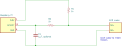
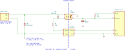

# ekm-meter-watcher

Script and Docker image for monitoring an EKM meter over GPIO and logging readings in SQLite.

## Setup

1. Build the image:

```sh
docker build -t ekm-meter-watcher .
```

2. Create a `docker-compose.yaml` like this:

```yaml
services:
  ekm-meter-watcher:
    image: ghcr.io/snoack/ekm-meter-watcher:latest
    restart: unless-stopped
    devices:
      - /dev/gpiochip4:/dev/gpiochip4
    # environment:
    #   EKM_GPIO: "27"
    #   EKM_TIMEOUT: "10"
    #   EKM_LOG_LEVEL: WARNING
    #   EKM_AGGREGATE_AFTER_WEEKS: "6"
    #   EKM_AGGREGATE_BY_SECONDS: "3600"
    #   EKM_AGGREGATE_INTERVAL: "86400"
    volumes:
      - ./data:/data
```

These environment variables are optional; the commented values shown above
are the defaults.

3. Start it:

```sh
docker compose up -d
```

The host still needs to expose the GPIO character device you map in `devices`.

## Wiring

By default the watcher reads pulses from GPIO `27`, which is physical pin `13`
on the Raspberry Pi. If using a different GPIO pin set `EKM_GPIO` accordingly.
Avoid GPIO `2` and `3`: the Pi has `1.8 kOhm` pull-ups on them for I2C.

The EKM meter's pulse output is an S0 interface: a polarized, passive
transistor switch between `S0+` and `S0-` that closes for `90 ms`, `800` times
per kWh used. It is rated for up to `27 V` and `27 mA` and needs an external
supply, which the circuits below provide.

Both circuits pull the GPIO input low while the contact is closed. The watcher
requests the line with bias disabled, so the external pull-up is required.

### Simple

For a short cable run indoors, connect the meter directly:



1. `R1`, `1 kOhm` from `3.3 V` to `S0+`, pulls the input up. About `3.3 mA`
   flows when the contact closes. That is plenty for the meter's output
   transistor and holds the line firmly against noise on the cable.
2. `R2`, `1 kOhm` between `S0+` and the GPIO, limits the current into the pin
   if the cable picks up a spike.
3. `C1`, `1 uF` from the GPIO to `GND`, is optional. Together with `R2` it
   filters glitches shorter than about `1 ms`, so spikes picked up by the
   cable aren't counted as pulses. The meter's output is a transistor and
   doesn't bounce, so on a short indoor run it can be left out.
4. Connect `S0-` to `GND`. Mind the polarity: the output does not conduct
   with `S0+` and `S0-` swapped.

No supply rail leaves the Pi: shorting the cable, or either wire to earth,
just draws `3.3 mA` through `R1`.

### Isolated

For longer cable runs, or wherever surges are a concern, isolate the meter
loop from the Pi:



| Ref  | Part                 | Purpose                                                      |
| ---- | -------------------- | ------------------------------------------------------------ |
| `U1` | PC817                | Optocoupler, `5 kV` isolation between the loop and the Pi     |
| `U2` | B0505S               | Isolated `5 V` DC-DC converter that powers the meter loop     |
| `R1` | `270 Ohm`, `1/4 W`   | Sets the loop current to about `8.5-14.5 mA`                  |
| `D4` | 1N4148               | Protects the optocoupler LED against reverse voltage          |
| `D6` | P6KE10A              | TVS diode, clamps surges on `S0+` to earth                    |
| `R2` | `10 kOhm`, `1/4 W`   | Pull-up on the GPIO                                           |
| `C1` | `100 nF` ceramic     | Filters glitches shorter than about `1 ms` together with `R2` |

`S0-` and the anode of `D6` are joined and bonded to earth with a single short
jumper, e.g. `14 AWG`, no longer than `30 cm` / `1 ft`, to the rack ground bar.
With the contact closed the GPIO reads low; with it open, high.
